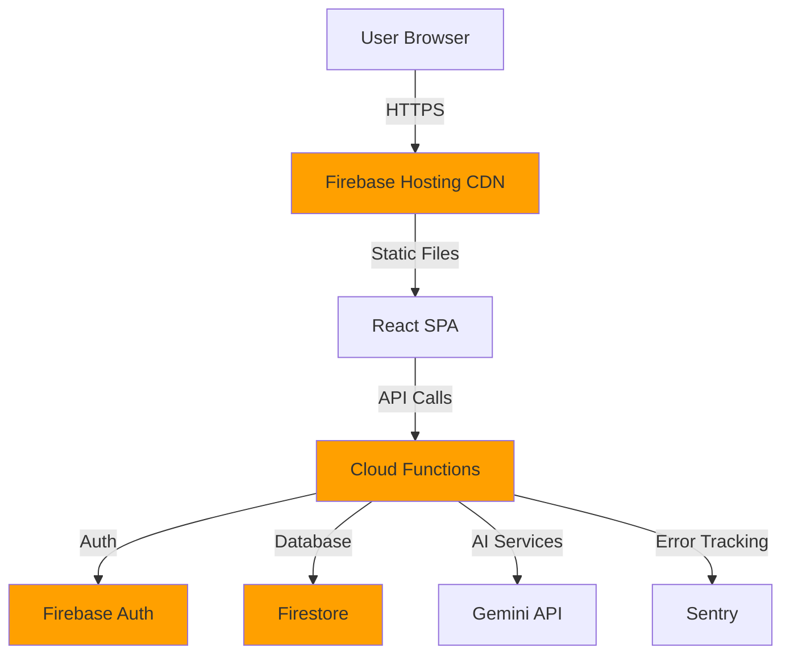

# Firebase Documentation

This directory contains comprehensive documentation about Firebase deployment, scaling, and operations for the IEH platform.

---

## 📚 Documentation Index

### Core Documentation

1. **[Firebase Deployment Architecture](./firebase-deployment.md)**
   - Complete guide to how the app deploys to Firebase
   - Architecture components (Hosting, Functions, Firestore, Auth)
   - Deployment process breakdown
   - Request flow diagrams
   - Configuration details
   - Best practices

2. **[Firebase Scaling](./firebase-scaling.md)**
   - Automatic scaling mechanisms
   - Scaling by component (Hosting, Functions, Firestore, Auth)
   - Performance optimization strategies
   - Cost implications and optimization
   - Traffic spike handling
   - Geographic scaling

3. **[Quick Reference Guide](./firebase-quick-reference.md)**
   - Common deployment commands
   - Local development setup
   - Functions management
   - Firestore operations
   - Monitoring & debugging
   - Troubleshooting guide

---

## 🚀 Quick Start

### First-Time Setup
```bash
# Install Firebase CLI
npm install -g firebase-tools

# Login to Firebase
firebase login

# Initialize project
firebase use ieh-project-id
```

### Daily Development
```bash
# Start local development
npm run dev:full

# Run tests
npm test

# Deploy to production
firebase deploy
```

---

## 📖 Additional Documentation

### Product & Technical
- **[PRD](./PRD.md)** - Product Requirements Document
- **[TRD](./TRD.md)** - Technical Requirements Document
- **[Requirements](./requirements.md)** - Detailed feature requirements
- **[Implementation Plan](./IMPLEMENTATION_PLAN.md)** - Development roadmap

### Standards & Guides
- **[Standards](./STANDARDS.md)** - Code standards and conventions
- **[Authentication](./auth.md)** - Auth implementation guide
- **[Cloud Management](./cloud_management.md)** - Cloud infrastructure management

### Architecture
- **[Architecture Overview](../architecture.md)** - High-level system architecture

---

## 🏗️ System Architecture Overview



---

## 🎯 Common Tasks

### Deploy New Feature
1. Develop locally with `npm run dev:full`
2. Run tests with `npm test`
3. Build with `npm run build`
4. Deploy with `firebase deploy`

### Debug Production Issue
1. Check logs: `firebase functions:log`
2. Review Sentry dashboard
3. Validate Firestore rules
4. Test with emulators

### Optimize Performance
1. Review [Scaling Guide](./firebase-scaling.md)
2. Check function execution times
3. Optimize database queries
4. Enable caching strategies

---

## 📊 Key Metrics

### Performance Targets
- Frontend load time: <2 seconds
- API response time: <500ms
- Function cold start: <3 seconds
- Database query: <100ms

### Scale Targets
- Concurrent users: 10,000+
- API requests/sec: 1,000+
- Database reads/sec: 10,000+
- Function instances: Auto-scaling (0-1,000)

---

## 🔗 Useful Links

- **Firebase Console**: [console.firebase.google.com](https://console.firebase.google.com)
- **Firebase Docs**: [firebase.google.com/docs](https://firebase.google.com/docs)
- **Sentry Dashboard**: [sentry.io](https://sentry.io)
- **Project Repository**: [GitHub](https://github.com/your-org/ieh)

---

## 🆘 Getting Help

### Internal Team
- Check `#engineering` Slack channel
- Review existing documentation in this folder
- Contact DevOps lead for infrastructure issues

### External Resources
- Firebase Discord: [discord.gg/firebase](https://discord.gg/firebase)
- Stack Overflow: Tag questions with `firebase`
- GitHub Issues: Report bugs in the repository

---

## 📝 Contributing to Documentation

When updating documentation:
1. Keep it concise and practical
2. Include code examples
3. Add diagrams where helpful (Mermaid syntax)
4. Test all commands before documenting
5. Update this README index when adding new docs

---

**Last Updated**: February 2026  
**Maintained By**: Engineering Team
