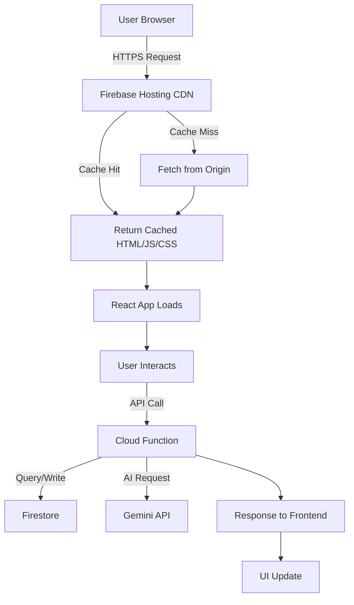
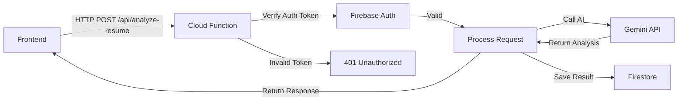
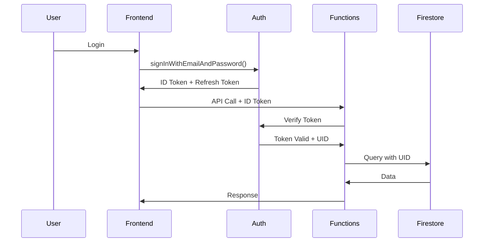

# Firebase Deployment Architecture

## Table of Contents
- [Overview](#overview)
- [Architecture Components](#architecture-components)
- [Deployment Process](#deployment-process)
- [Request Flow](#request-flow)
- [Configuration](#configuration)
- [Local vs Production](#local-vs-production)
- [Best Practices](#best-practices)

---

## Overview

This application uses **Firebase** as its deployment platform, leveraging multiple Firebase services to create a scalable, serverless architecture. The deployment consists of two main parts:

1. **Frontend** - React/Vite SPA served via Firebase Hosting
2. **Backend** - Node.js API and AI services running on Cloud Functions

Both parts work together seamlessly through Firebase's integrated infrastructure.

---

## Architecture Components

### 1. Firebase Hosting (Frontend)

**Purpose:** Serves the static React application globally

**What Gets Deployed:**
- HTML entry point (`index.html`)
- JavaScript bundles (optimized, minified, code-split)
- CSS stylesheets
- Static assets (images, fonts, icons)
- Service worker (if applicable)

**Key Features:**
- **Global CDN** - Content delivered from edge locations worldwide
- **SSL/TLS** - Automatic HTTPS certificates
- **Custom Domains** - Support for custom domain mapping
- **Automatic Caching** - Static assets cached at the edge
- **SPA Routing** - Fallback to `index.html` for client-side routing

**Build Output Location:** `dist/` (after `npm run build`)

**URL Pattern:** `https://your-project.web.app` or `https://your-project.firebaseapp.com`

---

### 2. Cloud Functions (Backend)

**Purpose:** Serverless API endpoints and background processing

**What Gets Deployed:**
- Express.js API routes (`functions/index.js`)
- AI service handlers (Gemini API integration)
- Authentication middleware
- Database interaction logic
- Background jobs and triggers

**Key Features:**
- **Serverless Execution** - Functions run on-demand, scale automatically
- **HTTPS Endpoints** - Each function gets a secure HTTP endpoint
- **Firestore Triggers** - React to database changes
- **Auth Triggers** - React to user creation/deletion
- **Automatic Scaling** - 0 to millions of requests without configuration

**Source Location:** `functions/` directory

**URL Pattern:** `https://us-central1-your-project.cloudfunctions.net/functionName`

---

### 3. Firestore (Database)

**Purpose:** NoSQL document database

**What Gets Deployed:**
- Security rules (`firestore.rules`)
- Database indexes (`firestore.indexes.json`)

**Access Patterns:**
- **Client-side** - Direct access with security rules enforcement
- **Server-side** - Admin SDK with full access (bypasses rules)

---

### 4. Firebase Authentication

**Purpose:** User authentication and authorization

**Features:**
- Email/Password authentication
- Custom claims for role-based access control
- Token refresh and session management
- Integration with Firestore rules and Cloud Functions

---

## Deployment Process

### Step-by-Step Breakdown

When you run `firebase deploy`, here's what happens:

```bash
firebase deploy
```

#### 1. Pre-Deployment Validation
- Checks Firebase project configuration (`.firebaserc`)
- Validates `firebase.json` syntax
- Authenticates with Firebase CLI

#### 2. Frontend Build
```bash
# Automatically runs (from firebase.json predeploy hooks)
npm run build
```

**Build Process:**
- Vite compiles TypeScript to JavaScript
- Tree-shaking removes unused code
- Code splitting creates optimized chunks
- Assets are hashed for cache busting
- Source maps generated (optional)
- Output written to `dist/`

**Example Build Output:**
```
dist/
├── index.html
├── assets/
│   ├── index-a1b2c3d4.js      # Main bundle
│   ├── vendor-e5f6g7h8.js     # Dependencies
│   ├── feature-i9j0k1l2.js    # Lazy-loaded route
│   └── styles-m3n4o5p6.css    # Styles
└── images/
    └── logo-q7r8s9t0.png
```

#### 3. Hosting Deployment
- Uploads all files from `dist/` to Firebase CDN
- Applies rewrite rules from `firebase.json`
- Invalidates CDN cache for updated files
- New version becomes active immediately

**Network Transfer:**
- Only changed files are uploaded (differential sync)
- Files are compressed during transfer
- Deployment typically takes 30-60 seconds

#### 4. Functions Deployment
```bash
# Packages and deploys Cloud Functions
```

**Packaging Process:**
- Runs `npm install --production` in `functions/`
- Creates deployment package with dependencies
- Uploads package to Google Cloud Platform
- Triggers function deployment and cold start

**Deployment Time:**
- Small functions: 30-60 seconds
- Large functions (with dependencies): 2-5 minutes
- Concurrent deployments supported

#### 5. Firestore Rules & Indexes
- Uploads `firestore.rules` and validates syntax
- Creates/updates composite indexes from `firestore.indexes.json`
- Index building can take several minutes for large datasets

---

## Request Flow

### Frontend Request Flow



### Backend Request Flow



### Authentication Flow



---

## Configuration

### firebase.json

```json
{
  "hosting": {
    "public": "dist",
    "ignore": [
      "firebase.json",
      "**/.*",
      "**/node_modules/**"
    ],
    "rewrites": [
      {
        "source": "/api/**",
        "function": "api"
      },
      {
        "source": "**",
        "destination": "/index.html"
      }
    ],
    "headers": [
      {
        "source": "/**",
        "headers": [
          {
            "key": "Cache-Control",
            "value": "public, max-age=31536000"
          }
        ]
      }
    ]
  },
  "functions": {
    "source": "functions",
    "predeploy": [
      "npm --prefix \"$RESOURCE_DIR\" run lint"
    ],
    "runtime": "nodejs20"
  },
  "firestore": {
    "rules": "firestore.rules",
    "indexes": "firestore.indexes.json"
  }
}
```

**Key Configuration Sections:**

#### Hosting Rewrites
- **`/api/**` → Cloud Function** - All API requests routed to backend
- **`**` → `/index.html`** - SPA fallback for client-side routing

#### Headers
- **Cache-Control** - Long-term caching for static assets
- **Security Headers** - CSP, X-Frame-Options (add as needed)

#### Functions
- **Source** - Location of Cloud Functions code
- **Runtime** - Node.js version (currently 20)
- **Predeploy** - Linting before deployment

---

## Local vs Production

| Aspect | Local Development | Production (Firebase) |
|--------|-------------------|----------------------|
| **Frontend** | Vite dev server (`http://localhost:5173`) | Firebase Hosting (CDN, HTTPS) |
| **Backend** | Express server (`http://localhost:3001`) | Cloud Functions (serverless) |
| **Hot Reload** | ✅ Instant | ❌ Requires rebuild + deploy |
| **Database** | Firestore (production or emulator) | Firestore (production) |
| **Auth** | Firebase Auth (production) | Firebase Auth (production) |
| **Build** | Development build (source maps, no minification) | Production build (optimized, minified) |
| **HTTPS** | HTTP (self-signed cert optional) | HTTPS (automatic) |
| **Environment** | `.env` file | Environment variables (Functions config) |
| **Scaling** | Single instance | Automatic, unlimited |
| **Cost** | Free (local compute) | Pay-per-use |

### Local Development Commands

```bash
# Start both frontend and backend concurrently
npm run dev:full

# Or separately:
npm run dev          # Frontend only (Vite)
npm run server       # Backend only (Express)

# Firebase emulators (optional)
firebase emulators:start
```

### Production Deployment Commands

```bash
# Full deployment
firebase deploy

# Deploy specific targets
firebase deploy --only hosting    # Frontend only
firebase deploy --only functions  # Backend only
firebase deploy --only firestore  # Rules + indexes only

# Deploy specific function
firebase deploy --only functions:api
```

---

## Best Practices

### 1. Environment Variables

**Frontend (.env):**
```bash
VITE_FIREBASE_API_KEY=your-api-key
VITE_FIREBASE_PROJECT_ID=your-project-id
# Never commit VITE_GEMINI_API_KEY in production
```

**Backend (Functions):**
```bash
# Set via Firebase CLI
firebase functions:config:set gemini.api_key="your-key"

# Access in code
const geminiKey = functions.config().gemini.api_key;
```

⚠️ **Security:**
- Never expose API keys in frontend code for production
- Use Cloud Functions as a proxy for sensitive API calls
- Implement rate limiting and request validation

### 2. Deployment Strategy

**Pre-Deployment Checklist:**
- [ ] Run tests (`npm test`)
- [ ] Run linter (`npm run lint`)
- [ ] Build locally (`npm run build`) and verify
- [ ] Check environment variables are set
- [ ] Review Firestore rules for security

**Deployment Workflow:**
```bash
# 1. Run quality checks
npm run lint
npm test

# 2. Build frontend
npm run build

# 3. Deploy to Firebase
firebase deploy

# 4. Test production deployment
# Visit your app URL and verify functionality
```

### 3. Rollback Strategy

If deployment fails or introduces bugs:

```bash
# View deployment history
firebase hosting:channel:list

# Rollback to previous version (manual process)
# 1. Check out previous git commit
git log --oneline
git checkout <commit-hash>

# 2. Redeploy
firebase deploy --only hosting
```

### 4. Performance Optimization

**Frontend:**
- Use code splitting (React.lazy)
- Lazy load routes
- Optimize images (WebP, compression)
- Enable service worker for offline support
- Use CDN for large assets

**Backend:**
- Keep function code minimal (extract heavy logic)
- Use connection pooling for database
- Implement caching (Redis, in-memory)
- Set appropriate function timeouts
- Use function regions close to users

### 5. Monitoring

**Firebase Console:**
- Monitor function execution times
- Track error rates and logs
- Review hosting bandwidth usage
- Check Firestore read/write metrics

**Integration with Sentry:**
- Frontend errors captured via Sentry SDK
- Backend errors logged in Cloud Functions
- Performance monitoring for critical paths

---

## Cost Optimization

### Resources That Cost Money

| Service | Free Tier | Pricing After Free Tier |
|---------|-----------|-------------------------|
| **Hosting** | 10 GB storage, 360 MB/day bandwidth | $0.026/GB storage, $0.15/GB bandwidth |
| **Functions** | 2M invocations/month, 400K GB-s compute | $0.40/M invocations, $0.0000025/GB-s |
| **Firestore** | 1 GB storage, 50K reads, 20K writes/day | $0.18/GB, $0.06/100K reads, $0.18/100K writes |
| **Auth** | Unlimited (email/password) | Free for basic auth |

**Cost Reduction Tips:**
- Use Firestore caching to reduce reads
- Optimize function execution time (faster = cheaper)
- Compress and lazy-load frontend assets
- Use batch writes for Firestore
- Monitor and set budget alerts

---

## Troubleshooting

### Common Deployment Issues

**1. Build Fails**
```bash
# Error: Module not found
npm ci           # Clean install
npm run build    # Retry build
```

**2. Function Deployment Timeout**
```bash
# Increase timeout (firebase.json)
{
  "functions": {
    "timeoutSeconds": 60
  }
}
```

**3. Firestore Rules Syntax Error**
```bash
# Test rules locally
firebase emulators:start --only firestore
```

**4. CORS Issues**
```javascript
// functions/index.js
const cors = require('cors')({ origin: true });
app.use(cors);
```

---

## Summary

This Firebase architecture provides:
- ✅ **Scalability** - Automatic scaling for both frontend and backend
- ✅ **Performance** - Global CDN for frontend, low-latency functions
- ✅ **Security** - HTTPS, authentication, database rules
- ✅ **Cost-Effective** - Pay only for what you use
- ✅ **Developer Experience** - Simple deployment, integrated services
- ✅ **Reliability** - 99.95% uptime SLA from Google

For scaling details, see [firebase-scaling.md](./firebase-scaling.md).
