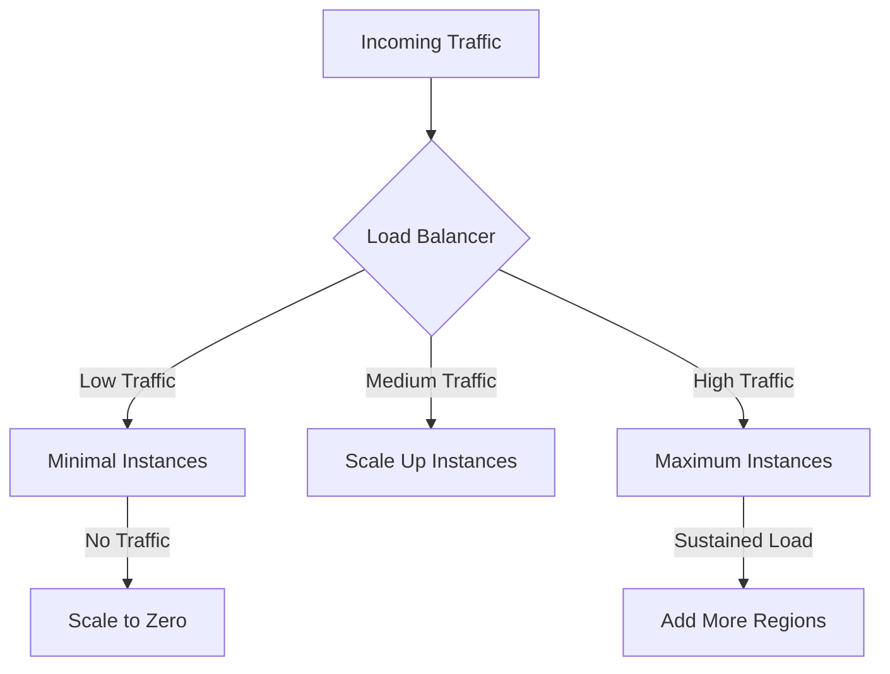
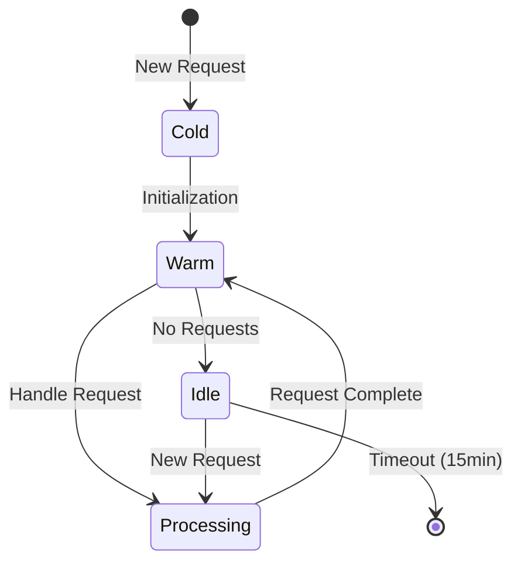

# Firebase Scaling Architecture

## Table of Contents
- [Overview](#overview)
- [Automatic Scaling Mechanisms](#automatic-scaling-mechanisms)
- [Scaling by Component](#scaling-by-component)
- [Performance Optimization](#performance-optimization)
- [Monitoring & Metrics](#monitoring--metrics)
- [Cost Implications](#cost-implications)
- [Scaling Strategies](#scaling-strategies)

---

## Overview

Firebase provides **automatic, serverless scaling** across all its services. Unlike traditional server-based architectures where you must manually provision capacity, Firebase scales automatically based on demand.

### Key Scaling Principles

1. **Zero Configuration Scaling** - No manual intervention required
2. **Pay-per-Use** - Scale from 0 to millions seamlessly
3. **Global Distribution** - Content served from edge locations
4. **Automatic Load Balancing** - Requests distributed optimally
5. **No Cold Start Penalties** (for most services)

---

## Automatic Scaling Mechanisms

### How Firebase Scales



### Scaling Triggers

Firebase automatically scales based on:

| Metric | Trigger | Response |
|--------|---------|----------|
| **Request Rate** | Increasing req/sec | Spin up more function instances |
| **Response Time** | Latency > threshold | Add compute capacity |
| **Geographic Demand** | High traffic from region | Route to nearest edge |
| **Database Load** | High read/write rate | Increase Firestore capacity |
| **Storage Access** | High bandwidth usage | Expand CDN capacity |

---

## Scaling by Component

### 1. Firebase Hosting (Frontend)

#### How It Scales

**Architecture:**
- Content is cached on Google's global CDN (150+ edge locations)
- Requests are served from the nearest edge location
- Origin servers automatically scale based on cache miss rate

**Scaling Characteristics:**
```
User in Tokyo → Tokyo Edge → Cache Hit (0ms origin latency)
User in London → London Edge → Cache Hit (0ms origin latency)
User in NYC → NYC Edge → Cache Miss → US Origin → Cache for next request
```

**Capacity:**
- **Bandwidth**: Unlimited (cost scales with usage)
- **Requests**: Unlimited
- **Concurrent Users**: Unlimited
- **Geographic Coverage**: 150+ edge locations globally

**Performance at Scale:**
| Traffic Level | Latency | Throughput |
|---------------|---------|------------|
| 1K users/sec | <50ms | Unlimited |
| 10K users/sec | <50ms | Unlimited |
| 100K users/sec | <50ms | Unlimited |
| 1M users/sec | <50ms | Unlimited |

#### Optimization Tips

```javascript
// firebase.json - Optimize caching
{
  "hosting": {
    "headers": [
      {
        "source": "/assets/**",
        "headers": [{
          "key": "Cache-Control",
          "value": "public, max-age=31536000, immutable"
        }]
      },
      {
        "source": "/**/*.@(jpg|jpeg|gif|png|webp)",
        "headers": [{
          "key": "Cache-Control",
          "value": "public, max-age=2592000"
        }]
      }
    ]
  }
}
```

**Best Practices:**
- Use content hashing for cache busting (Vite does this automatically)
- Compress assets (gzip/brotli)
- Use WebP for images
- Implement lazy loading for images and routes
- Enable HTTP/2 server push (automatic in Firebase)

---

### 2. Cloud Functions (Backend)

#### How It Scales

**Autoscaling Mechanism:**
1. **Instance Creation** - New request arrives
2. **Cold Start** - If no warm instance available, create new one (1-5 seconds)
3. **Warm Instance** - Reuse existing instance for subsequent requests (<10ms)
4. **Scaling Down** - Idle instances terminated after 10-15 minutes

**Scaling Limits (Configurable):**

```javascript
// functions/index.js
const runtimeOpts = {
  timeoutSeconds: 60,
  memory: '1GB',
  minInstances: 0,  // Default: scale to zero
  maxInstances: 100, // Default: 1000
};

exports.api = functions
  .runWith(runtimeOpts)
  .https.onRequest(app);
```

**Instance Lifecycle:**



**Scaling Performance:**

| Metric | Value |
|--------|-------|
| **Cold Start Time** | 1-5 seconds (Node.js 20) |
| **Warm Response Time** | 10-100ms |
| **Max Concurrent Instances** | 1,000 (default), 3,000 (max) |
| **Max Requests per Instance** | 1 (HTTP functions) |
| **Instance Lifetime** | 15 minutes idle timeout |

#### Optimization Strategies

**1. Minimize Cold Starts**

```javascript
// Keep at least 1 instance warm for critical functions
exports.api = functions
  .runWith({
    minInstances: 1,  // Always keep 1 warm instance
    maxInstances: 100,
  })
  .https.onRequest(app);
```

**Cost vs Performance Trade-off:**
- `minInstances: 0` - Lowest cost, potential cold starts
- `minInstances: 1` - ~$10/month, eliminates most cold starts
- `minInstances: 5` - ~$50/month, handles traffic spikes

**2. Reduce Function Size**

```javascript
// ❌ Bad: Large dependencies
const _ = require('lodash'); // 70kb
const moment = require('moment'); // 67kb

// ✅ Good: Minimal dependencies
const { format } = require('date-fns'); // 2kb (tree-shaken)
```

**3. Optimize Execution Time**

```javascript
// Cache expensive operations
let cachedData;
let cacheTime;

exports.api = functions.https.onRequest(async (req, res) => {
  // Reuse cached data within instance lifetime
  if (!cachedData || Date.now() - cacheTime > 300000) { // 5 min
    cachedData = await expensiveOperation();
    cacheTime = Date.now();
  }
  
  res.json(cachedData);
});
```

**4. Use Connection Pooling**

```javascript
// ❌ Bad: New connection per request
exports.api = functions.https.onRequest(async (req, res) => {
  const db = await connectToDatabase();
  // ...
});

// ✅ Good: Reuse connection across requests
const admin = require('firebase-admin');
admin.initializeApp(); // Initialize once

exports.api = functions.https.onRequest(async (req, res) => {
  // admin is already initialized
  const db = admin.firestore();
  // ...
});
```

---

### 3. Firestore (Database)

#### How It Scales

**Automatic Scaling:**
- No configuration needed
- Handles millions of concurrent connections
- Automatically shards data across servers
- Distributes load based on access patterns

**Scaling Characteristics:**

| Metric | Limit |
|--------|-------|
| **Concurrent Connections** | Unlimited |
| **Reads per Second** | 10,000+ per collection |
| **Writes per Second** | 500/sec per document, 10,000+ per collection |
| **Database Size** | Unlimited (petabyte-scale) |
| **Query Performance** | O(log n) with indexes |

#### Bottlenecks & Solutions

**1. Document Contention (Hot Documents)**

**Problem:**
```javascript
// ❌ Single document updated by many users
await db.collection('stats').doc('global').update({
  views: admin.firestore.FieldValue.increment(1)
});
// Limit: ~500 writes/sec to same document
```

**Solution:**
```javascript
// ✅ Distributed counters
const shardId = Math.floor(Math.random() * 10);
await db.collection('stats').doc('global').collection('shards').doc(shardId.toString()).update({
  views: admin.firestore.FieldValue.increment(1)
});

// Read aggregated count
const snapshot = await db.collection('stats').doc('global').collection('shards').get();
const totalViews = snapshot.docs.reduce((sum, doc) => sum + doc.data().views, 0);
```

**2. Large Collection Queries**

**Problem:**
```javascript
// ❌ Unindexed query on large collection
const jobs = await db.collection('jobs')
  .where('status', '==', 'active')
  .where('salary', '>', 100000)
  .get();
// Slow without composite index
```

**Solution:**
```json
// firestore.indexes.json
{
  "indexes": [
    {
      "collectionGroup": "jobs",
      "queryScope": "COLLECTION",
      "fields": [
        { "fieldPath": "status", "order": "ASCENDING" },
        { "fieldPath": "salary", "order": "DESCENDING" }
      ]
    }
  ]
}
```

**3. Batch Operations**

**Problem:**
```javascript
// ❌ Sequential writes (slow)
for (const user of users) {
  await db.collection('users').doc(user.id).set(user);
}
```

**Solution:**
```javascript
// ✅ Batched writes (up to 500 per batch)
const batch = db.batch();
users.forEach(user => {
  const ref = db.collection('users').doc(user.id);
  batch.set(ref, user);
});
await batch.commit();
```

#### Read Optimization

**1. Use Caching**

```javascript
// Frontend: Cache Firestore queries
const jobsQuery = query(
  collection(db, 'jobs'),
  where('status', '==', 'active')
);

const unsubscribe = onSnapshot(jobsQuery, 
  { includeMetadataChanges: true },
  (snapshot) => {
    snapshot.docChanges().forEach((change) => {
      if (change.type === 'added' && !change.doc.metadata.fromCache) {
        console.log('New job from server');
      } else if (change.doc.metadata.fromCache) {
        console.log('Job from cache (free read)');
      }
    });
  }
);
```

**2. Pagination**

```javascript
// ✅ Cursor-based pagination (efficient)
const firstPage = await db.collection('jobs')
  .orderBy('createdAt', 'desc')
  .limit(20)
  .get();

const lastDoc = firstPage.docs[firstPage.docs.length - 1];

const nextPage = await db.collection('jobs')
  .orderBy('createdAt', 'desc')
  .startAfter(lastDoc)
  .limit(20)
  .get();
```

---

### 4. Firebase Authentication

#### How It Scales

**Capacity:**
- Unlimited user accounts
- Unlimited concurrent logins
- Sub-100ms token verification
- Global distribution for auth endpoints

**No Configuration Required:**
- Automatically handles millions of users
- Token refresh happens seamlessly
- Rate limiting built-in (prevents abuse)

---

## Performance Optimization

### Frontend Optimization

**1. Code Splitting**

```typescript
// src/App.tsx
import { lazy, Suspense } from 'react';

const Dashboard = lazy(() => import('./pages/Dashboard'));
const Jobs = lazy(() => import('./pages/Jobs'));
const Profile = lazy(() => import('./pages/Profile'));

function App() {
  return (
    <Suspense fallback={<LoadingSpinner />}>
      <Routes>
        <Route path="/dashboard" element={<Dashboard />} />
        <Route path="/jobs" element={<Jobs />} />
        <Route path="/profile" element={<Profile />} />
      </Routes>
    </Suspense>
  );
}
```

**2. Bundle Size Reduction**

```typescript
// vite.config.ts
export default defineConfig({
  build: {
    rollupOptions: {
      output: {
        manualChunks: {
          'vendor': ['react', 'react-dom', 'react-router-dom'],
          'firebase': ['firebase/app', 'firebase/auth', 'firebase/firestore'],
          'ai': ['@google/genai'],
        }
      }
    }
  }
});
```

**3. Image Optimization**

```typescript
// Use WebP with fallback
<picture>
  <source srcSet="/images/hero.webp" type="image/webp" />
  
</picture>
```

### Backend Optimization

**1. Reduce Function Execution Time**

```javascript
// ❌ Sequential AI calls (slow)
const analysis1 = await callGemini(prompt1);
const analysis2 = await callGemini(prompt2);

// ✅ Parallel AI calls (fast)
const [analysis1, analysis2] = await Promise.all([
  callGemini(prompt1),
  callGemini(prompt2)
]);
```

**2. Implement Request Deduplication**

```javascript
const pendingRequests = new Map();

async function deduplicatedFetch(key, fetchFn) {
  if (pendingRequests.has(key)) {
    return pendingRequests.get(key);
  }
  
  const promise = fetchFn();
  pendingRequests.set(key, promise);
  
  try {
    const result = await promise;
    return result;
  } finally {
    pendingRequests.delete(key);
  }
}
```

**3. Use Firestore Efficiently**

```javascript
// ❌ N+1 query problem
const jobs = await db.collection('jobs').get();
for (const job of jobs.docs) {
  const company = await db.collection('companies').doc(job.data().companyId).get();
  // Expensive: N reads
}

// ✅ Batch reads
const jobDocs = await db.collection('jobs').get();
const companyIds = [...new Set(jobDocs.docs.map(doc => doc.data().companyId))];
const companies = await db.getAll(
  ...companyIds.map(id => db.collection('companies').doc(id))
);
```

---

## Monitoring & Metrics

### Key Metrics to Track

**1. Firebase Console Metrics**

| Metric | Location | Alert Threshold |
|--------|----------|----------------|
| Function Execution Time | Functions → Dashboard | >3 seconds |
| Function Error Rate | Functions → Logs | >1% |
| Hosting Bandwidth | Hosting → Usage | Approaching quota |
| Firestore Reads | Firestore → Usage | Sudden spike |
| Firestore Writes | Firestore → Usage | >50K/day |

**2. Custom Application Metrics (Sentry)**

```typescript
// Track custom metrics
import * as Sentry from '@sentry/react';

Sentry.startSpan(
  {
    op: 'ai.analysis',
    name: 'Resume Analysis',
  },
  async (span) => {
    const start = Date.now();
    const result = await analyzeResume(resume);
    const duration = Date.now() - start;
    
    span.setAttribute('duration_ms', duration);
    span.setAttribute('resume_length', resume.length);
    
    if (duration > 5000) {
      logger.warn('Slow resume analysis', { duration });
    }
    
    return result;
  }
);
```

**3. Real User Monitoring (RUM)**

```typescript
// Track page load performance
window.addEventListener('load', () => {
  const perfData = performance.getEntriesByType('navigation')[0];
  
  Sentry.startSpan({
    op: 'pageload',
    name: window.location.pathname,
  }, (span) => {
    span.setAttribute('dom_interactive', perfData.domInteractive);
    span.setAttribute('load_time', perfData.loadEventEnd);
  });
});
```

---

## Cost Implications

### Scaling Costs

**Cost Breakdown at Different Scales:**

#### Small Scale (1K users/month)
```
Hosting:        $0 (within free tier)
Functions:      $0 (within free tier)
Firestore:      $0 (within free tier)
Auth:           $0 (free)
Total:          $0/month
```

#### Medium Scale (50K users/month)
```
Hosting:        $5 (bandwidth)
Functions:      $20 (10M invocations)
Firestore:      $30 (2M reads, 500K writes)
Auth:           $0 (free)
Total:          ~$55/month
```

#### Large Scale (500K users/month)
```
Hosting:        $50 (bandwidth)
Functions:      $200 (100M invocations)
Firestore:      $300 (20M reads, 5M writes)
Auth:           $0 (free)
Total:          ~$550/month
```

### Cost Optimization Strategies

**1. Reduce Function Invocations**

```javascript
// ❌ Function per request (expensive)
exports.getUser = functions.https.onRequest(async (req, res) => {
  const user = await db.collection('users').doc(req.query.id).get();
  res.json(user.data());
});

// ✅ Client-side reads when possible (cheaper)
// Frontend reads directly from Firestore (covered by security rules)
const user = await getDoc(doc(db, 'users', userId));
```

**2. Batch Firestore Reads**

```javascript
// ❌ Individual reads (expensive)
const job1 = await db.collection('jobs').doc('id1').get();
const job2 = await db.collection('jobs').doc('id2').get();
const job3 = await db.collection('jobs').doc('id3').get();
// Cost: 3 reads

// ✅ Batch read (cheaper)
const jobs = await db.getAll(
  db.collection('jobs').doc('id1'),
  db.collection('jobs').doc('id2'),
  db.collection('jobs').doc('id3')
);
// Cost: 3 reads (same), but single network round-trip
```

**3. Use Firestore Caching**

```typescript
// Enable offline persistence (free cached reads)
import { enableIndexedDbPersistence } from 'firebase/firestore';

enableIndexedDbPersistence(db)
  .catch((err) => {
    if (err.code === 'failed-precondition') {
      console.warn('Multiple tabs open, persistence enabled in first tab only');
    }
  });
```

**4. Optimize Function Memory**

```javascript
// ❌ Over-provisioned (expensive)
exports.simpleApi = functions.runWith({ memory: '2GB' }).https.onRequest(app);
// Cost: 2x memory = 2x price

// ✅ Right-sized (cost-effective)
exports.simpleApi = functions.runWith({ memory: '256MB' }).https.onRequest(app);
// Cost: Baseline price
```

---

## Scaling Strategies

### Traffic Spike Handling

**Scenario: Product Hunt Launch (10x traffic spike)**

**Preparation:**
1. **Increase Function Limits**
   ```javascript
   exports.api = functions.runWith({
     minInstances: 5,  // Pre-warm instances
     maxInstances: 500, // Allow high concurrency
   }).https.onRequest(app);
   ```

2. **Enable Firestore Caching**
   ```typescript
   // Cache frequently accessed data
   const cachedJobs = await db.collection('jobs')
     .where('featured', '==', true)
     .get({ source: 'cache' });
   ```

3. **Add Rate Limiting**
   ```javascript
   const rateLimit = require('express-rate-limit');
   
   const limiter = rateLimit({
     windowMs: 15 * 60 * 1000, // 15 minutes
     max: 100 // limit each IP to 100 requests per windowMs
   });
   
   app.use('/api/', limiter);
   ```

### Geographic Scaling

**Multi-Region Deployment:**

```javascript
// Deploy functions to multiple regions
exports.apiUS = functions.region('us-central1').https.onRequest(app);
exports.apiEU = functions.region('europe-west1').https.onRequest(app);
exports.apiAsia = functions.region('asia-northeast1').https.onRequest(app);
```

**Frontend Routing:**
```typescript
// Route to nearest function based on user location
const region = detectUserRegion();
const apiUrl = {
  'US': 'https://us-central1-project.cloudfunctions.net/apiUS',
  'EU': 'https://europe-west1-project.cloudfunctions.net/apiEU',
  'ASIA': 'https://asia-northeast1-project.cloudfunctions.net/apiAsia',
}[region];
```

---

## Summary

### Scaling Capabilities

| Component | Max Capacity | Bottleneck | Solution |
|-----------|--------------|------------|----------|
| **Hosting** | Unlimited | Bandwidth cost | CDN caching, compression |
| **Functions** | 3,000 instances | Cold starts | Min instances, code optimization |
| **Firestore** | Petabyte-scale | Hot documents | Sharding, batching |
| **Auth** | Unlimited | Rate limiting | Exponential backoff |

### Key Takeaways

1. **Firebase scales automatically** - No manual configuration needed
2. **Optimize for cost** - Caching, batching, right-sizing
3. **Monitor performance** - Track metrics, set alerts
4. **Plan for spikes** - Pre-warm instances, rate limiting
5. **Test at scale** - Load testing before major launches

For deployment details, see [firebase-deployment.md](./firebase-deployment.md).
